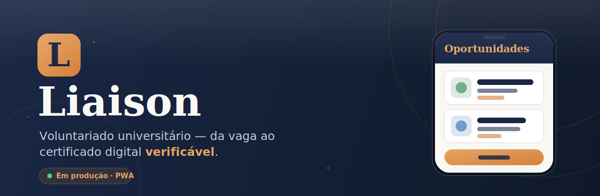

  

  
  
  

  
  
  

---

<h3 align="center">Suas horas de extensão viram experiência real de voluntariado.</h3>

  A extensão universitária é <strong>obrigatória</strong> — mas achar vagas, comprovar presença e conseguir 
  certificados é burocrático e disperso. <strong>Liaison</strong> junta tudo num fluxo único, transparente e mobile-first: 
  do primeiro toque na vaga ao <strong>certificado digital verificável por qualquer pessoa</strong>.

  <a href="https://liaison.gcsoftware.tech"><strong>liaison.gcsoftware.tech</strong></a> — abra no navegador do celular ou desktop e instale como um app de verdade. Sem loja, sem espera.

 

## O que dá pra fazer

<table>
<tr>
<td width="50%" valign="top">

### Para estudantes

- **Descobrir oportunidades** — busca e filtros para achar a vaga certa.
- **Candidatar-se em toques** — detalhes da vaga e envio direto no app.
- **Salvar vagas** — guarde o que interessa para decidir depois.
- **Acompanhar candidaturas** — status de cada uma, a qualquer momento.
- **Montar o perfil** — foto, biografia e galeria.
- **Certificado digital** — comprove suas horas ao concluir.

</td>
<td width="50%" valign="top">

### Para organizações

- **Publicar e gerenciar vagas** — criar, editar, publicar, encerrar.
- **Gerenciar candidatos** — veja quem se candidatou, com perfil.
- **Avaliar candidaturas** — aprove voluntários e registre notas.
- **Registrar frequência** — controle a presença na atividade.
- **Emitir certificados** — reconheça a participação, verificável.
- **Perfil da organização** — apresente sua ONG, login por CNPJ.

</td>
</tr>
</table>

> **Certificados verificáveis por qualquer pessoa.** Cada certificado tem uma página pública de validação por código — autenticidade garantida, sem depender do app.

 

## Como acessar

<table>
<tr>
<td width="33%" align="center">
<h4>App web (PWA)</h4>
<a href="https://liaison.gcsoftware.tech">liaison.gcsoftware.tech</a> 
Celular ou desktop · instalável
</td>
<td width="33%" align="center">
<h4>Android</h4>
<a href="https://github.com/mdsreq-fga-unb/REQ-2026.1-T01-Liaison/releases/latest">Última release</a> 
APK + link sempre na tag mais recente
</td>
<td width="33%" align="center">
<h4>Documentação</h4>
<a href="https://mdsreq-fga-unb.github.io/REQ-2026.1-T01-Liaison">GitHub Pages</a> 
Requisitos, arquitetura e entregas
</td>
</tr>
</table>

 

## Time

Projeto da disciplina **Engenharia de Requisitos de Software** — REQ-T1, 2026.1 · UnB/FGA · **Grupo Dona Izeti**.

## Para desenvolvedores

Rodar o projeto localmente, testes e arquitetura: **[`docs/DESENVOLVIMENTO.md`](docs/DESENVOLVIMENTO.md)**.
Contexto técnico e decisões: [`CLAUDE.md`](./CLAUDE.md) · [`context/DECISIONS.md`](./context/DECISIONS.md) · [`context/GOTCHAS.md`](./context/GOTCHAS.md).
