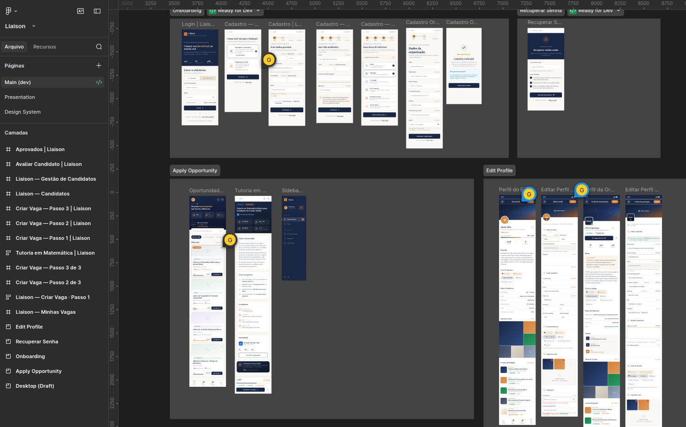
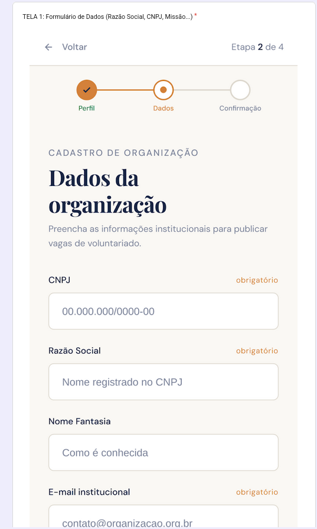
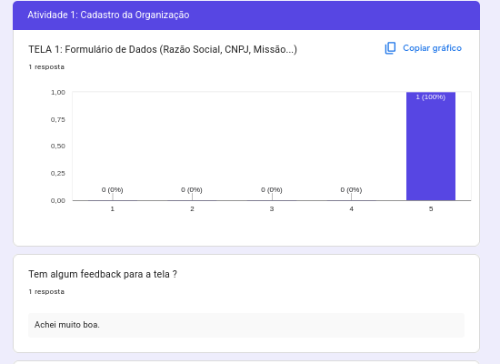
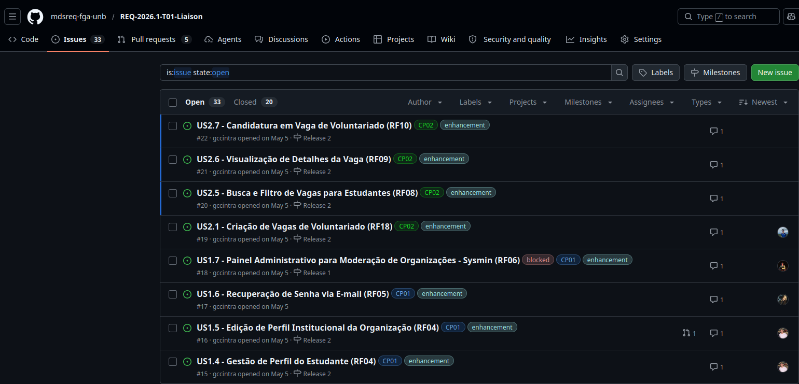
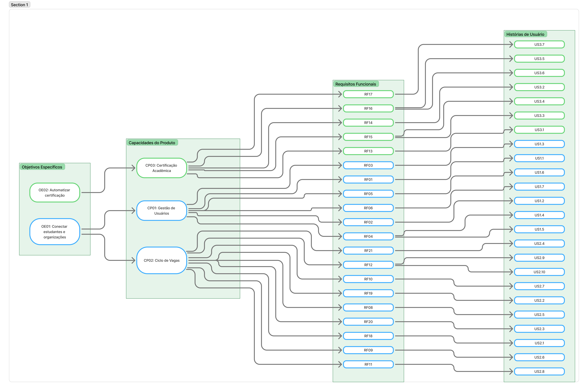
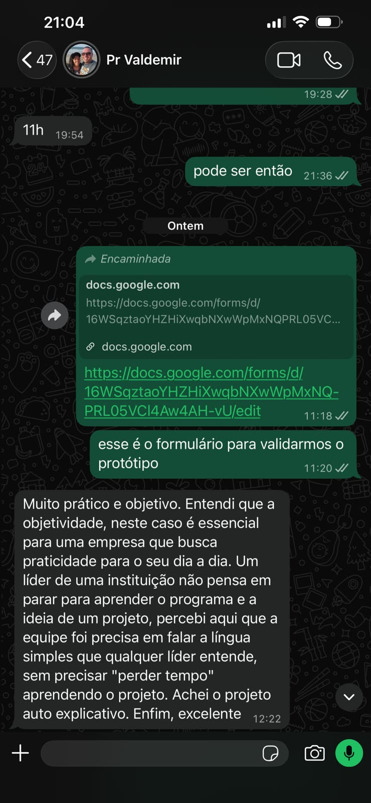

# Evidências de Engenharia de Requisitos (ER)

## Fase 1 - Planejamento de Requisitos

### Elicitação e Descoberta
Realizamos a primeira reunião com o Cliente (Pastor Valdemir) para mapear o fluxo manual atual de voluntariado e descobrir as principais dores das organizações.

* **Evidência:** [Ata de Reunião 03: Elicitação com o Cliente](atas/ata_01_elicitaçao_valdemir_12_04.md)
  > **O que esta Ata evidencia?** A primeira **entrevista e validação inicial com o cliente**, comprovando a descoberta dos requisitos originais do projeto.

### Declaração dos Requisitos
* [Requisitos declarados](docs/projeto/requisitos_software.md)

### Verificação e Validação dos requisitos
* Requisitos foram verificados e validados com o cliente como mostrado nessa reunião:

* Além disso aqui está os documentos de priorização e qual foi decidido nosso MVP:
     [Priorização e MVP](../projeto/backlog_produto.md#104-anexos-de-priorizacao)

---
## Fase 2 - User Design

### Representação
> Protótipos de alta fidelidade.

* **Figma -** 
<iframe style="border: 1px solid rgba(0, 0, 0, 0.1);" width="800" height="450" src="https://embed.figma.com/design/f6bQuVohTvZLF5WWPEbNob/Liaison?node-id=0-1&embed-host=share" allowfullscreen></iframe>

### Verificação das telas 
* Para ser feita a verificação das telas foi feito um formulário para o cliente avaliar (na escala likert e com um campo aberto) a tela prototipada 

### Declaração 

* Declaração das US do projeto: 

### Organização e Atualização

* Mapa de rastrabilidade:

### Validação de protótipos
* O protótipo de alta fidelidade foi apresentado ao cliente, que aprovou o fluxo para solucionar o controle manual de voluntários da igreja.

---

## Fase 3 - Construção

### Critérios de Aceite (DoD) e BDD
Durante a construção, garantimos que a implementação de todas as issues do MVP atendessem rigorosamente à *Definition of Done* (DoD). Para isso, as histórias de usuário (US) foram traduzidas para cenários BDD/Gherkin diretamente nos Pull Requests, funcionando como um checklist exato dos requisitos.
* **Evidência:** [Ata 10 - Revisão de Sprints e Adaptação de Escopo (23/06)](atas/ata_10_monitoria_23_06.md)
  > **O que o vídeo/ata evidencia?** Uma reunião de **Alinhamento Técnico**, comprovando a decisão arquitetural e metodológica de refatorar as issues para seguir o formato de Critérios de Aceite BDD, fortalecendo a rastreabilidade entre requisito e código final.

### Demonstração e Validação do Cliente (Entrega do MVP)
Após o término do desenvolvimento, o sistema (Frontend Mobile e Backend Django) foi empacotado para testes práticos e uso real. O cliente manipulou o sistema livremente no próprio dispositivo (via web mobile app).
* **Evidência:** [Ata 12 - Validação Final Cliente (01/07)](atas/ata_12_validacao_final_cliente_01_07.md)
  > **O que o vídeo/ata evidencia?** Uma sessão síncrona de **Validação de Software Funcional**, comprovando que o cliente testou os fluxos de criar vaga e gerir voluntários, aprovando-os de acordo com suas expectativas originais e validando o valor entregue pela solução.

### Feedback Consolidado e Histórico
Toda a trajetória de evolução, desde a elicitação até a entrega do MVP, com o respectivo "de acordo" do cliente ou do monitor de disciplina, foi consolidada em um único registro.
* **Evidência:** [Matriz de Feedback Consolidado](feedback_consolidado.md)
  > **O que este documento evidencia?** Um **Registro Centralizado de Validação**, servindo para comprovar as decisões tomadas, ajustes no backlog, artefatos apresentados e a rastreabilidade dos status das Entregas ao longo de toda a disciplina.
