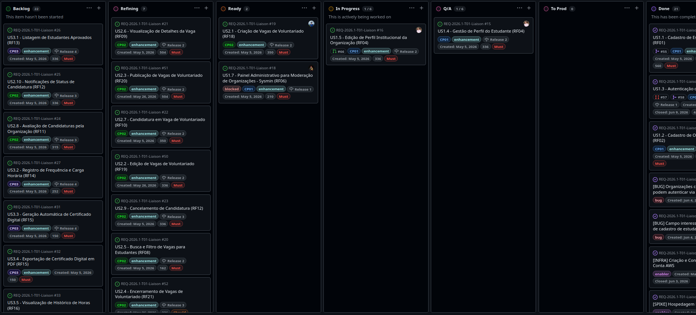
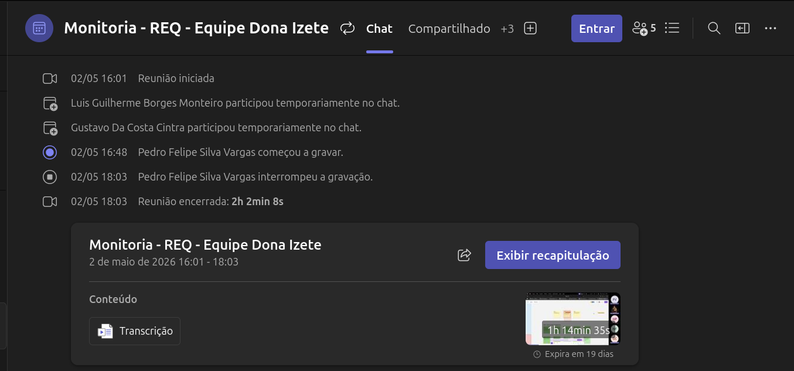
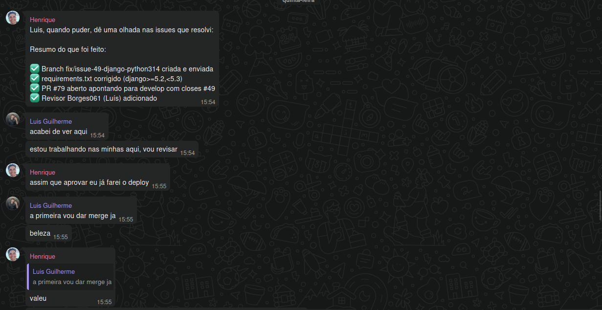
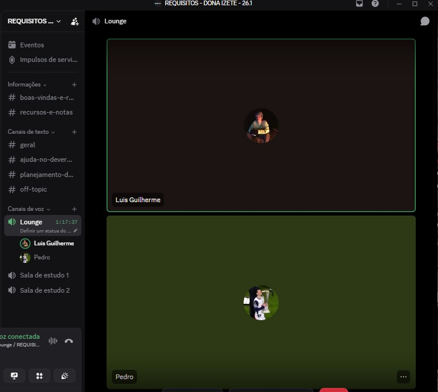
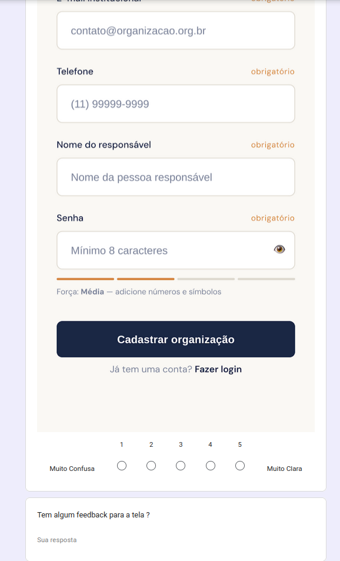

# Evidências de Engenharia de Software (ESW)

## Uso do GitHub Projects
Durante o curso do projeto, usamos o GitHub Projects para atribuição de tarefas e delegação de responsabilidades.

### Organização das tarefas dentro do GitHub Projects
* *Figura 1: Tasks no GitHub Projects*`

---

## Uso do Teams
Foi a ferramenta usada para reuniões síncronas.

### Reuniões via Teams
* *Figura 2: Reuniões no Teams*

---

## Uso do WhatsApp
Ferramenta usada para comunicação rápida, dailies assíncronas.

### Dailies assíncronas

* *Figura 3: Dailies assíncronas no WhatsApp*

---

### Pair Programming
* *Figura 4: Pair Programming*

---
<!--
## TDD e Ferramentas de Código
Exemplos do uso de Test Driven Development e outras ferramentas.

### Criação de Testes (Red / Green)
> *(Print mostrando os testes que vocês já implementaram no projeto)*
* `*Figura 6: Caso de teste falhando no backend (Red)*`
* ``
* `*Figura 7: Cobertura de Testes Frontend aprovada (Green)*`
* ``
* *Resultado Alcançado:* [Escreva aqui sobre os 112 testes do back e 206 do front, referenciando o PR 13].

---
-->
## Protótipos e Validação Contínua (KanbanXP)
No KanbanXP, a validação contínua com o cliente sobre o produto e os incrementos iterativos é fundamental.

### Validação de Telas

---

## Teste de Usuário e Homologação (Entrega MVP)
No final do ciclo de vida do projeto, os princípios do Extreme Programming (XP) referentes a *releases frequentes* (ou pequenas entregas de valor) se solidificaram na apresentação do MVP.

### Demonstração e Uso Real (Validação Final)
Ao invés de apenas focar em formulários estáticos de usabilidade, a equipe submeteu o cliente a uma validação interativa usando o software empacotado para o dispositivo móvel.
* **Evidência:** [Ata 12 - Validação Final Cliente (01/07)](atas/ata_12_validacao_final_cliente_01_07.md)
  > **O que o vídeo/ata evidencia?** Uma **Sessão Prática de Validação de Software Funcional**. Este documento comprova o envolvimento do cliente no final da cadeia de desenvolvimento, validando a integração dos componentes frontend e backend e atestando que a engenharia de software aplicada resultou num produto de valor útil ao negócio (cadastro, vaga, frequência e emissão de QR Code).

### Qualidade de Código e Fechamento de Issues
Para chegar ao MVP com o código funcional e minimizar falhas, a equipe instaurou ritos de "mutirões" (war rooms) para fechamento de Pull Requests e garantia de que o projeto passasse nos critérios de integração antes do release.
* **Evidência:** [Ata 11 - Monitoria de Fechamento de Issues (30/06)](atas/ata_11_monitoria_30_06.md)
  > **O que o vídeo/ata evidencia?** Uma **Reunião de Acompanhamento Técnico e Resolução de Impedimentos**. Ele atesta o uso prático de pareamento (Pair Programming), fechamento colaborativo de issues cruciais e avaliação de Pull Requests para viabilizar a entrega técnica na data prevista.
