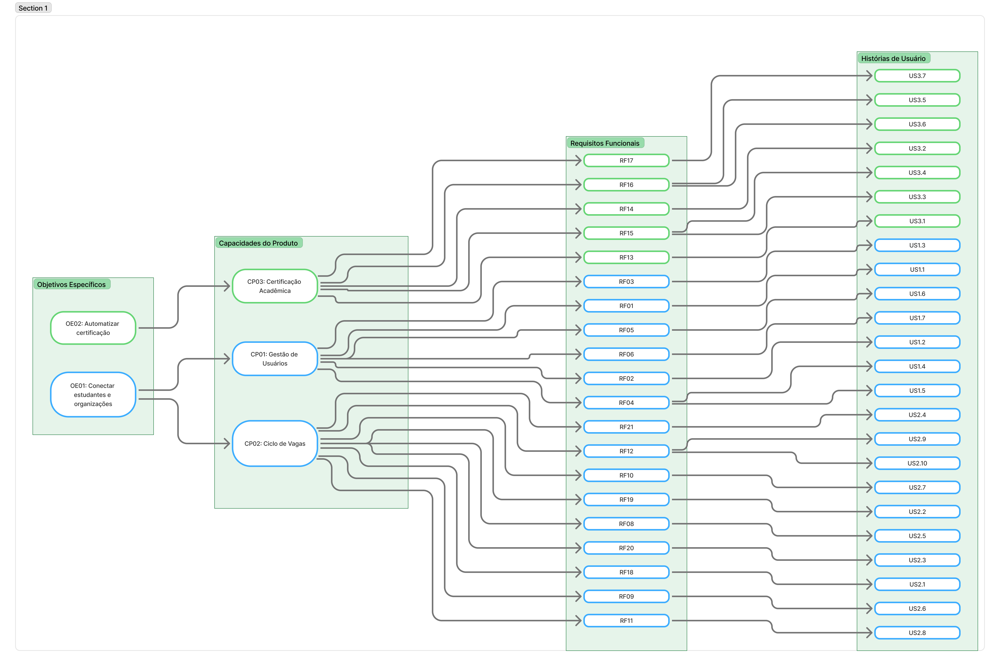

# Rastreabilidade de Requisitos

A rastreabilidade garante que cada funcionalidade desenvolvida no software possua uma justificativa clara de negócio, conectando problemas reais às soluções entregues pela equipe.

Abaixo apresentamos a matriz de rastreabilidade (Forward Traceability) que mapeia o fluxo: *Problema > Objetivos > Características de Produto > RFs > User Stories (US)*.

## Matriz de Rastreabilidade

  
  
<em>Figura 1: Matriz de Rastreabilidade (Problema &gt; CP &gt; RF &gt; US)</em>

## Como interpretar a Rastreabilidade

1.⁠ ⁠*Problema e Objetivos:* Derivados das sessões de elicitação com o cliente e documentados na seção [Cenário Atual](../projeto/cenario.md) e [Solução Proposta](../projeto/solucao.md).
2.⁠ ⁠*Características do Produto (CPs):* Agrupamentos épicos de funcionalidades que encapsulam fluxos completos de valor, documentados nos [Requisitos de Software](../projeto/requisitos_software.md).
3.⁠ ⁠*Requisitos Funcionais (RFs):* As ações técnicas sistêmicas que suportam a característica do produto.
4.⁠ ⁠*User Stories (US):* A unidade atômica de implementação, escrita do ponto de vista do usuário final e rastreada via ID de Issue no quadro Kanban do GitHub, documentadas no [Backlog do Produto](../projeto/backlog_produto.md).
