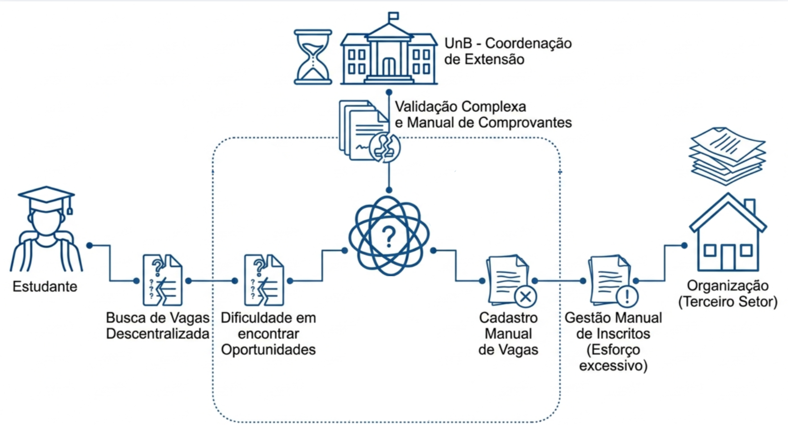
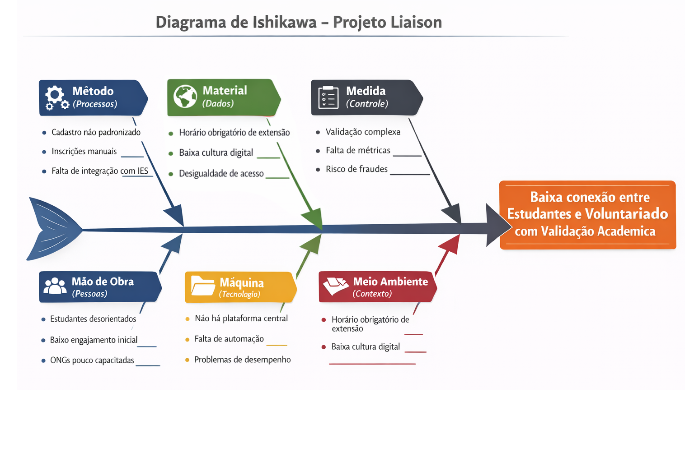
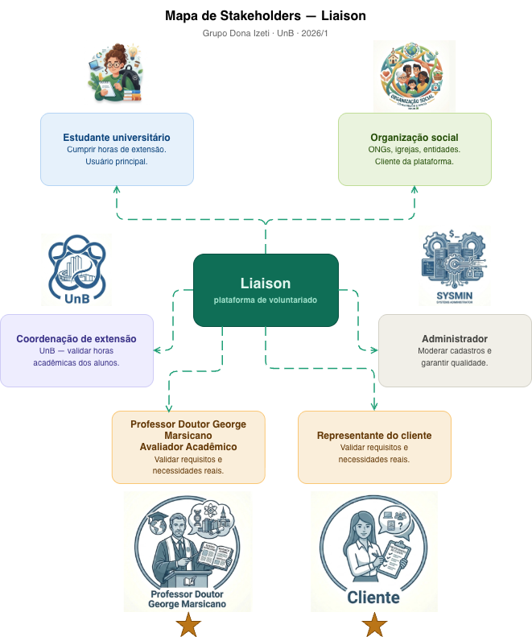

# 1 CENÁRIO ATUAL DO CLIENTE E DO NEGÓCIO

## 1.1 Identificação do Cliente/Parceiro

| Campo | Informação |
| :--- | :--- |
| **Nome** | Valdemir (Pastor) |
| **Tipo** | Organização social - igreja com atuação em apoio social comunitário |
| **Representante** | Valdemir (Pastor) |
| **Forma de contato** | WhatsApp, Google Formulário, Microsoft Teams, entrevistas presenciais, reuniões online quinzenais. |
| **Vínculo com o projeto** | Cliente e usuário direto da solução; validador das regras de negócio relativas ao gerenciamento de voluntários. |

## 1.2 Introdução ao Negócio e Contexto

O voluntariado é uma prática consolidada no Brasil, regulamentada pela Lei n.º 9.608/1998, e desempenha papel fundamental no fortalecimento de organizações da sociedade civil. Paralelamente, as Diretrizes Curriculares Nacionais para a Educação Superior determinam que as Instituições de Ensino Superior incorporem atividades de extensão universitária correspondentes a, no mínimo, 10% da carga horária total dos cursos de graduação (Resolução CNE/CES n.º 7/2018). Essa exigência faz com que estudantes precisem, ao longo de sua formação, engajar-se em atividades extracurriculares que incluam projetos sociais, culturais e de voluntariado.

Nesse contexto, tanto os estudantes universitários quanto as organizações do terceiro setor enfrentam dificuldades estruturais. Os estudantes têm dificuldade em localizar oportunidades organizadas e com reconhecimento acadêmico, enquanto as organizações carecem de canais eficientes para recrutar e gerenciar voluntários. A ausência de uma plataforma centralizada que atenda a ambos os lados representa uma lacuna relevante no ecossistema de extensão universitária brasileiro.

A solução proposta nasce para preencher essa lacuna, atuando como uma ponte digital entre estudantes universitários e organizações sociais, promovendo simultaneamente o desenvolvimento pessoal e acadêmico dos estudantes e o fortalecimento das entidades beneficiadas.

## 1.3 Rich Picture

**Descrição narrativa:** O estudante universitário possui necessidade de horas de extensão e interesse em contribuir com a sociedade, mas não encontra, de forma organizada, oportunidades compatíveis com seu perfil e disponibilidade. Do outro lado, ONGs, igrejas, asilos, abrigos de animais e projetos comunitários necessitam de voluntários, mas enfrentam dificuldades para divulgar atividades e gerir inscrições. A coordenação de extensão das universidades precisa validar as participações dos alunos para fins de integralização curricular. A plataforma Liaison atua como o elo central desse ecossistema, conectando todos esses atores em um ambiente digital estruturado.

## 1.4 Identificação da Oportunidade ou Problema

O projeto responde a dois problemas concretos identificados pelo grupo:

*   **Problema do estudante:** Estudantes universitários com obrigação curricular de cumprir horas de extensão não dispõem de um canal único onde possam localizar, se inscrever e obter comprovante de atividades de voluntariado. O processo atual depende de buscas dispersas (sites de ONGs, grupos de redes sociais, murais físicos) e de solicitação manual de documentos à organização, o que aumenta o tempo gasto e o risco de não completar as horas no prazo letivo.
*   **Problema das organizações:** ONGs, igrejas e entidades sociais que dependem de voluntários não possuem, em geral, ferramentas para publicar vagas, receber inscrições, registrar presença e emitir comprovantes em um único sistema. O resultado é uso de canais fragmentados (WhatsApp, planilhas, e-mail), com perda de histórico e dificuldade de auditoria.

A partir dessa problemática, foi elaborado um Diagrama de Ishikawa, com o objetivo de identificar as principais causas da baixa conexão entre esses atores, considerando aspectos relacionados a processos, tecnologia, pessoas, dados e validação institucional.

A oportunidade identificada reside na ausência de um mecanismo que facilite a comunicação com foco específico na conexão entre estudantes universitários e atividades de voluntariado com validação acadêmica. Com base em pesquisa inicial realizada pelo grupo, não foram identificadas soluções que integrem, em um único ambiente, o fluxo completo desde a descoberta da oportunidade até a emissão do certificado reconhecido pela instituição de ensino, o que representa alto potencial de inovação no contexto universitário.

## 1.5 Desafios do Projeto

*   **Verificação de vínculos:** Garantir a autenticidade do vínculo acadêmico dos estudantes (matrícula ativa) e a legitimidade das organizações cadastradas (validação de CNPJ e atividade social comprovada).
*   **Engajamento e adoção:** Criar incentivos suficientes para que estudantes e organizações adotem a plataforma como canal principal, superando hábitos informais como grupos de WhatsApp e indicações pessoais.
*   **Diversidade de perfis institucionais:** Atender desde estudantes de universidades federais com regras rígidas de extensão até instituições privadas com formatos mais flexíveis de horas complementares.
*   **Confiabilidade dos dados de participação:** Assegurar que os registros de presença e carga horária sejam confiáveis para fins de validação acadêmica, evitando inconsistências ou fraudes.
*   **Escalabilidade:** Projetar a arquitetura para suportar crescimento no número de usuários e organizações cadastradas sem degradação de desempenho.

## 1.6 Mapa de Stakeholders

| Stakeholder | Relação com a solução | Interesses e expectativas | Nível de influência |
| :--- | :--- | :--- | :--- |
| **Estudantes universitários (voluntários)** | Usuário principal | Encontrar oportunidades de voluntariado alinhadas ao seu perfil; cumprir horas de extensão; obter certificados reconhecidos academicamente. | Alto |
| **Organização social (ONGs, igrejas, entidades e projetos comunitários)** | Cliente / usuário da plataforma | Publicar vagas; recrutar voluntários; controlar presença; comunicar-se com voluntários de forma organizada. | Alto |
| **Representante do cliente** | Porta-voz do cliente no projeto | Fornecer informações sobre as necessidades reais da organização; validar requisitos; participar das reuniões de elicitação ao longo do projeto. | Alto |
| **Coordenações de Extensão Universitária** | Validador / parceiro institucional | Garantir que as atividades cumpridas pelos alunos atendam aos critérios de horas de extensão exigidos pela IES. | Médio |
| **Administradores da plataforma** | Operação e suporte | Manter a plataforma operacional; moderar cadastros; garantir a qualidade e confiabilidade das informações publicadas. | Alto |
| **Prof. George Marsicano** | Avaliador acadêmico | Avaliar a qualidade dos artefatos e do produto entregue; verificar a aplicação correta das técnicas de ER ao longo do semestre. | Alto |

## 1.7 Segmentação de Clientes

Os usuários e clientes da plataforma podem ser segmentados em três perfis principais:

**Segmento 1 - Estudantes universitários com necessidade de horas de extensão**
*   Estudantes de graduação de qualquer curso em instituições públicas ou privadas que precisam cumprir horas de extensão obrigatórias.
*   Estudantes que, mesmo sem obrigatoriedade, buscam desenvolvimento pessoal, experiências práticas e capacitação profissional por meio do voluntariado.
*   Perfil predominante: jovens entre 18 e 30 anos, com acesso a smartphones e internet e familiaridade com plataformas digitais.

**Segmento 2 - Organizações sociais (cliente da plataforma)**
*   ONGs, fundações, associações comunitárias, igrejas, entidades religiosas, asilos, abrigos de animais e projetos sociais de pequeno e médio porte que necessitam de voluntários recorrentes.
*   Organizações com baixa capacidade de investimento em ferramentas de gestão, que se beneficiariam de uma solução gratuita ou de baixo custo.
*   Exemplos de atividades: leitura e companhia para idosos em asilos; apoio em abrigos de animais; campanhas de arrecadação; atividades educativas e comunitárias.

**Segmento 3 - Instituições de Ensino Superior (parceiras/validadoras)**
*   Coordenações de extensão universitária que necessitam de meios para validar e registrar a participação de alunos em atividades externas.
*   Representam um potencial parceiro institucional para integrações futuras, como validação de matrículas ou envio automatizado de relatórios de horas.
